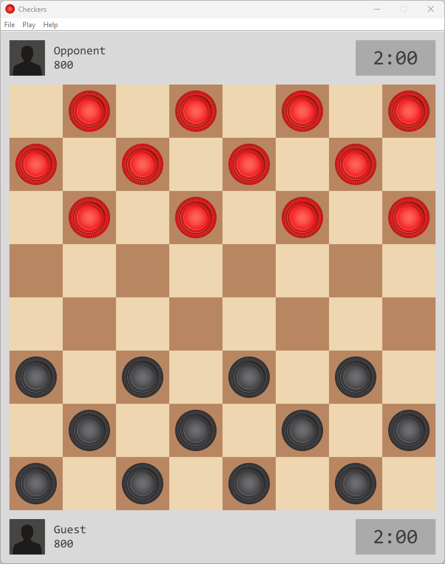
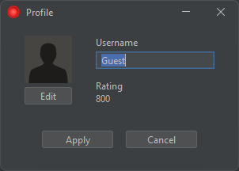
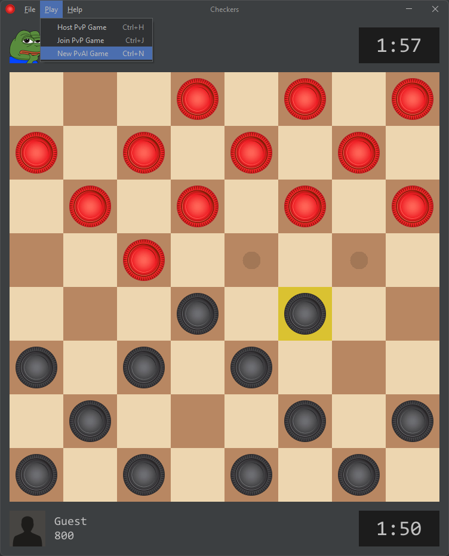
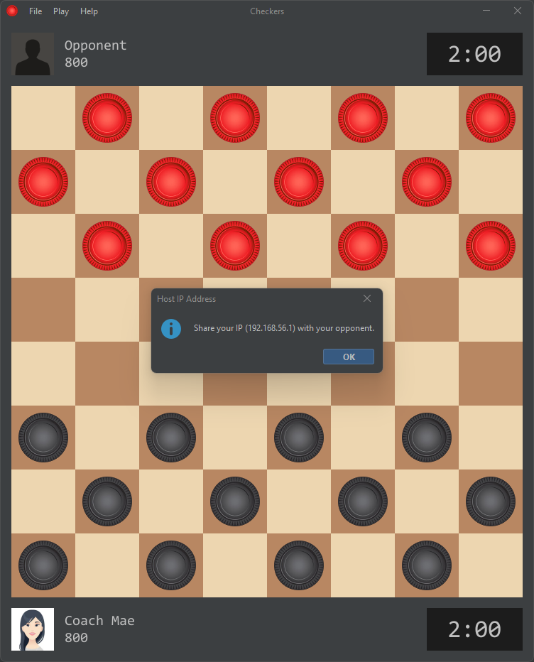
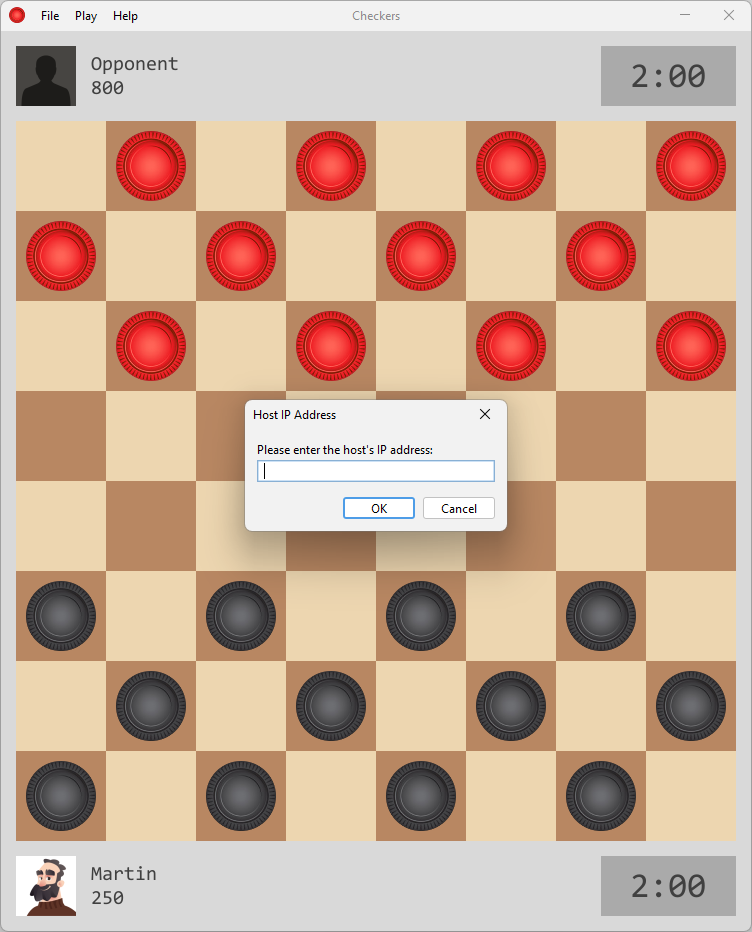
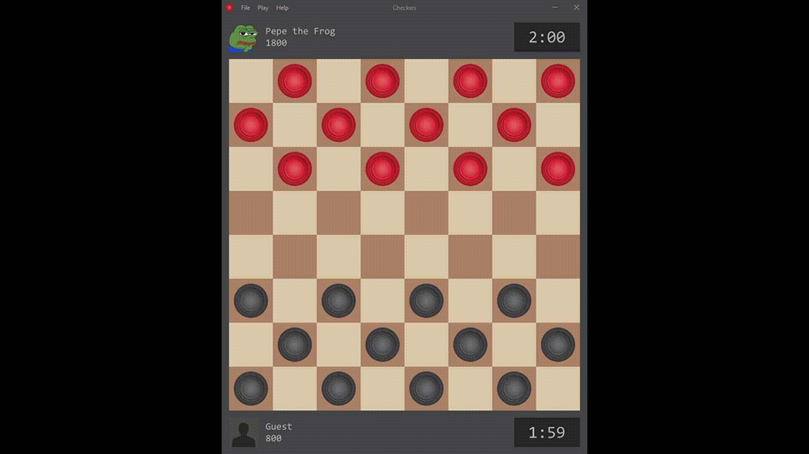
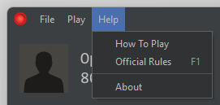
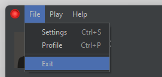

# Checkers
A [checkers](https://en.wikipedia.org/wiki/Checkers) (draughts) game with a modern graphical user interface. The objective of checkers is to capture all opponent pieces before the player's time limit ends. The game features a PvP and a PvAI game mode while incorporating custom settings, player profiles, a rating system, and a help menu.

## GUI
The GUI of this program is meant to be simplistic and modern, featuring a flat look and feel with familiar and high-quality sound effects and images used for the checker pieces, board, and window icon, which is present in all windows. Additionally, the game window displays the two playing parties' profiles, containing their avatar, username, rating, and timer.

|  |  |  |
|:--:|:--:|:--:| 
| *Native* | *Dark* | *Light* |

## Usage

### Settings
The user can choose between a native, dark, or light-themed GUI through the settings window. They can also enable audio feedback from the game. For the AI difficulty, the user can choose an intelligence level from 1 to 8. Moreover, the user can select the player time limit from a standard selection of 1 to 30 minutes. The user can also choose to play as black or red, with black playing first. When the user is done modifying the settings, they can hit apply to save the changes for future games or cancel to discard any modifications made.

### Profile
Users can change their username in the profile window by typing into the text field and hitting Apply to save the changes. Their read-only rating is also visible. Additionally, the user can press the edit button below their avatar to update it with a .png image chosen from their computer.

### Game Input
The user can play the game using a mouse. If a piece is clicked on, its position on the board will be highlighted, and its legal moves will be displayed. At this stage, the user can either click on any displayed legal move to perform it, select an alternate piece, or reset their selection by clicking on the empty space on the game board. In addition to mouse input, the user can use the set shortcuts for the relevant menu items or the mnemonic of each menu to interact with the menu bar.

### Play
Users can play against other users in their local network (PvP) or against an AI (PvAI).

When the user hosts a PvP game, their opponent can join the game by entering the host's displayed IP address, and a new game with the host's game settings will commence. During this time, the two players also transfer their profile information via the local network.

|  |  |
|:--:|:--:| 
| *Hosting* | *Joining* |

In addition to PvP, the user can play against a [Minimax](https://en.wikipedia.org/wiki/Minimax) AI locally. The AI has a friendly profile with a rating corresponding to its difficulty level.

### Additional Functionality
Lastly, the menu bar also contains a help menu with a simple tutorial on how to play, official rules, and relevant information about this program. Furthermore, in addition to the windows buttons, the user can exit the program through the file menu.

|  |  |
|:--:|:--:| 
| *Help* | *Exit* |

## Run

### Dependencies
- [Java 17 or later](https://www.oracle.com/java/technologies/downloads/)
- [Maven 3.5 or later](https://maven.apache.org/download.cgi) ([installation instructions](https://maven.apache.org/install.html))

### Build
In the terminal, navigate to the project folder and run the following command:

    mvn clean compile assembly:single

To execute the JAR file:

    java -jar target/checkers-1.0-jar-with-dependencies.jar

Note that a current build of the code is provided in the [target](target) directory, including the *checkers-1.0-jar-with-dependencies.jar* executable.

## Authors
Nabeth Ghazi ([nabethg](https://github.com/nabethg)) — maintainer

Edwin Sun ([edwinsun98](https://github.com/edwinsun98))

## Acknowledgements
*Checkers* uses [FlatLaf](https://github.com/JFormDesigner/FlatLaf) binaries available on Maven Central for stylization.

Credit to [Chess.com](https://www.chess.com/) from which many audio and visual media was sourced. :pray:

## License
[GNU General Public License Version 3](LICENSE)
